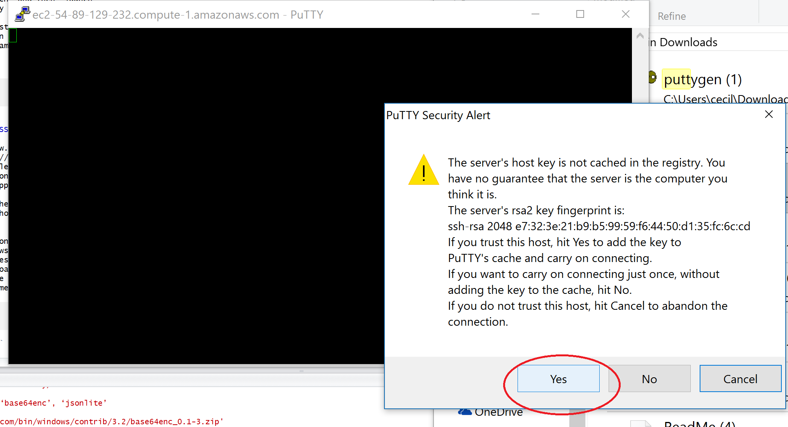

While we watched our colleagues Chris and Ben take the spindly road of SSH and terminal commands, herein lies the saga of an Ecologist navigating the road of computational biology but avoiding the fork towards computer science. Follow this guide step by step and you will have a model running on a server with little understanding of what is happening.

#**Beginning Amazon EC2 instance**

###1. open [amazon EC2 console](https://console.aws.amazon.com/ec2/)

###2. select "launch instance"
###3. select location on top right drop down menu
###4. select "community AMIs" on left tab
###5. find Rstudio server AMI appropriate for your location and needs 
    e.g. http://www.louisaslett.com/RStudio_AMI/, I used the "ami-0acd2067" server for US east coast, VA. This 
    server has Rstudio, jags, dropbox, github amongst other things already installed.
    (if you need something else, there are plenty of other servers to choose from. if you 
    feel so inclined, you can use a linux based AMI and install everything yourself)

&nbsp;
&nbsp;

&nbsp;
&nbsp;
    
###6. select the t2.micro general instance type (free tier eligible)
&nbsp;
&nbsp;

&nbsp;
&nbsp;

###7. If you don't need a lot of storage space, leave the storage and tag options alone. If you think you might need more than 10gb then you can increase the amount of storage. While the free tier does provide some storage, if you use a lot you may be billed for the extra.
###8. select "create a new security group" and http" security group to access AMI via browser (port 80) or ssh (port 22)

&nbsp;
&nbsp;

&nbsp;
&nbsp;

###9. select "review and launch" and then "launch"
###10. select "create a new key pair" in the pop up window and select "download key pair". Keep the downloaded file safe. If you need to use SSH in the future then you will need this key. It will also allow access to your instance so make sure its in a secure place.

&nbsp;
&nbsp;

&nbsp;
&nbsp;

###11. Launch instance.
###12. To stop (pause) your instance, go to the "Actions Menu" at the top of the instance list, go down to "instance state" and then hit "stop". Select "start" to resume instance. If you "terminate" the instance instead of "stopping" it then any associated storage will be deleted. While an instance is stopped you won't be billed for the instance (except for any associated storage).

&nbsp;
&nbsp;

&nbsp;
&nbsp;

###13. To interact with and run your instance in your browser, scroll down to your "Public DNS", copy and paste the url there, and paste in your browser of choice
###14. the login info is username: rstudio, password: rstudio (if you would like to change the password use passwd(), it will prompt you to provide the existing password and then type in a new password)
###15. start your work!
###16. to automatically stop your instance when model run is complete:
    -on your instance page select the alarm icon under "alarm status"
    -create an alarm:
      + check box next to "send notification to"
      + select create topic next to "send notification to"
      + create topic name
      + send notificaton to: your email
      + check box next to "take the action"
      + select what you want to happen when model is running. Most likely you want "stop this instance". 
      Don't mistake it for "terminate this instance" which will just delete everything that you did
      +complete when you want the notification and stop to happen. I've found that "Whenever *Average* 
      of *CPU Utilization* is *< 10%* for at least *1* consecutive period of *15*        
      *minutes*" seems to work pretty well for my purposes, but you may want a longer amount of time of 
      inactivity depending on what it is you're doing.I've found that I don't work fast enough in setting 
      up my model runs to go with the 5 minute interval of inactivity for instance stopping.
I recommend not setting an alarm until you've set everything up and have it running as setup work tends to not use much CPU.
&nbsp;
&nbsp;

&nbsp;
&nbsp;

Note: If you use the free tier instance, there is only one core. This means that if you close the tab while r is running commands, you can not reload it until its finished because the instance is too busy with r tasks to respond to your requests to the server. 

#**To bring in your R files from github**
Do this exactly as you normally would when starting a project in R:
Go to File --> new project --> version control --> git --> enter repository URL (can get this via green
"clone or download" button on top right of github repository) --> create project --> you will have to 
enter your github details (username, password) as usual.

#**A bit of code to export your model results to Dropbox**
This code needs to be run before uploading any projects from github because of the way that the function was written by the AMI creator.
```{r eval=FALSE}
require(RStudioAMI)
linkDropbox() #open a tab to allow access
excludeSyncDropbox("*") #stop syncing everything
```
This will give you a link in the working console to copy over and to give permission to AMI to access dropbox.

```{r eval=FALSE}
includeSyncDropBox("dropboxFolderName") #sync the folder that you want to upload your results to
```
This bit of code can go at the end of your model to save your model run(s) in your dropbox. Just switch out <foldername> for the directory in your dropbox account you'd like to save to.
```{r eval=FALSE}
save(file="~/Dropbox/<folderName>/outputFileName.Rdata", list="nameOfJagsOutput") #save model output in that folder on dropbox
```
#**Accessing Amazon EC2 via SSH on a PC (if you desperately wish to know how)**

###1. install [PuTTY](http://www.chiark.greenend.org.uk/~sgtatham/putty/download.html)
###2. download [PuTTYgen](http://www.chiark.greenend.org.uk/~sgtatham/putty/download.html)
###3. convert your .pem key file (created back at step 10) to a .ppk file that PuTTY can use
    -select the "load" button and load your saved key file. (what you saved in step 10 of the first section) 
    you may need to change file type to all files to see the .pem file.
    -save as private key (.ppk) - this file name needs to be *EXACTLY THE SAME* as they key that you saved in 
    step 11 above, otherwise an error occurs later in your PuTTY connection
    -close PuTTYgen
    
&nbsp;
&nbsp;

&nbsp;
&nbsp;

###4. open PuTTY
###5. host name (specific to the Rstudio server AMI): rstudio@public_dns_name
    (public dns will only show if instance is running)
    connection type: ssh
    port: 22
    
&nbsp;    
&nbsp;    

&nbsp;
&nbsp;

###6. Go to the Category pane on left --> expand Connection --> expand SSH --> select "Auth"
###7. under "Auth", click "Browse", select the .ppk file that you generated using PuTTYgen, click "Open".
###8. (Optional) to save the session information for future use, select Session in the Category tree, enter a name for the session in Saved Sessions, and then click Save. To reload, select the session then hit the "load".
###9. Click "Open" to start the PuTTY session.
###10. Putty security alert comes up, hit yes (if you trust the server).
###11. You are now connected to your instance via ssh and any commands you run in the putty terminal will be executed on the instance.
&nbsp;
&nbsp;

&nbsp;
